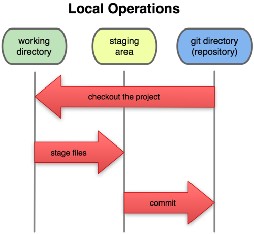

# Session1
- git 配置config如果后面跟有--global参数的时候，的的配置会应用到所有的库

- 工作目录(Working tree)，暂存区(index或者staged)，仓库(HEAD)

  

- pwd用于显示当前的目录路径,让后用git init初始化仓库

- 添加文件 ```git add <file file1 file2...>```

- 提交文件 ``` git commit -m "xxx"```

- ```git status``` 查看库是否被修改。

- 查看修改内容

  - 比较**工作目录(Working tree)**和**暂存区(Index)**

    ```git diff```

  - 比较**暂存区(Index)**与**仓库(HEAD)**

  ​       ```git diff --cached 或者 git diff --staged```

  - 比较**工作目录(Working tree)**和**仓库(HEAD)**

    ```git diff HEAD```

    ### 以上的所有比较后面都可以带参数

  ## 实际上的流程：

  

### Summary:修改完成后最好用status来看一下修改了什么，然后再commit


### **注意各种系统中的换行符号**
   - Uinx/Linux采用换行符LF表示下一行(LF:LineFeed,中文意思是换行);
   - Dos和Windows采用回车+换行CRLF表示下一行(CRLF:CarriageReturn LineFeed,中文意思是回车换行);
   - Mac OS采用回车CR表示下一行(CR:CarriageReturn,中文意思是回车)
# Session2
- ```git log``` 可以查看修改时间线，看看各个版本 而commit后面的一大串数字是SHA1(哈希算法)得出来的，代表每个版本号的id

- ```git reset --hard HEAD^```   这条命令可以回到上一个版本，用HEAD表示当前版本，上一个版本就是```HEAD^```，上上一个版本就是```HEAD^^```，当然往上100个版本写100个^比较容易数不过来，所以写成```HEAD~100```。

- 一旦回到上一个版本之后，当前版本就不会出现在log里面，只有用```git reset --hard [commit id]```才可以回到原来的版本,并且`commit id` 填前7位就可以了

- 上面其实都是骗你的，可以用```git reflog```来查看你每一次的变动版本，上面有每一次的id 

   


- 工作空间下面有个隐藏的.git的文件夹（版本库），当你初始化工作空间的时候会默认生成一个master的分支以及一个指向master的HEAD的指针，版本库里面有一个缓冲区  


# 文件管理

- 当你改乱了工作区某个文件的内容，想直接丢弃工作区的修改时，用命令`git checkout -- file`。
  - 优先从staged恢复，然后到HEAD
- 当你不但改乱了工作区某个文件的内容，还添加到了暂存区时，想丢弃修改，分两步，第一步用命令`git reset HEAD file`，此时stage被修改再用上面的命令恢复work tree
- 先在client创建ssh-key` ssh-keygen -t rsa -C "youremail@example.com"`，在服务器端(目前指的是github)添加ssh密钥，用于验证。
- 关联仓库`git remote add origin git@server-name:path/repo-name.git`
- 克隆远程仓库 `git clone git@server-name:path/repo-name.git`

#分支管理

- 推送本地分支`git push -u origin [client_branch1...]` ,第一次push最好添加参数-u，**client_branch**不填的话默认当前分区,推送所有client_branch后面参数直接改成--all就可以


- `git branch branch-name`创建分区，`git checkout branch-name`切换分区，`git checkout -b branch-name`创建分区并且切换