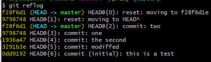

### Session1
1. git 配置config如果后面跟有--global参数的时候，的的配置会应用到所有的库
2. pwd用于显示当前的目录路径,让后用git init初始化仓库
3. 1. ```git add <file file1 file2...>```
   2. ``` git commit -m "xxx"```
4. ```git status``` 查看库是否被修改。```git diff```可以查看修改内容

Summary:修改完成后最好用status来看一下修改了什么，然后再commit
### Session2
1. **注意各种系统中的换行符号**
   1. Uinx/Linux采用换行符LF表示下一行(LF:LineFeed,中文意思是换行);
   2. Dos和Windows采用回车+换行CRLF表示下一行(CRLF:CarriageReturn LineFeed,中文意思是回车换行);
   3. Mac OS采用回车CR表示下一行(CR:CarriageReturn,中文意思是回车)
2. ```git log``` 可以查看修改时间线，看看各个版本 而commit后面的一大串数字是SHA1(哈希算法)得出来的，代表每个版本号的id
3. ```git reset --hard HEAD^```   这条命令可以回到上一个版本，用HEAD表示当前版本，上一个版本就是```HEAD^```，上上一个版本就是```HEAD^^```，当然往上100个版本写100个^比较容易数不过来，所以写成```HEAD~100```。
4. 一旦回到上一个版本之后，当前版本就不会出现在log里面，只有用```git reset --hard [commit id]```才可以回到原来的版本,ps：commit id 可以只填前7位就可以了
5. 上面其实都是骗你的，可以用```git reflog```来查看你每一次的变动版本，上面有每一次的id 

 